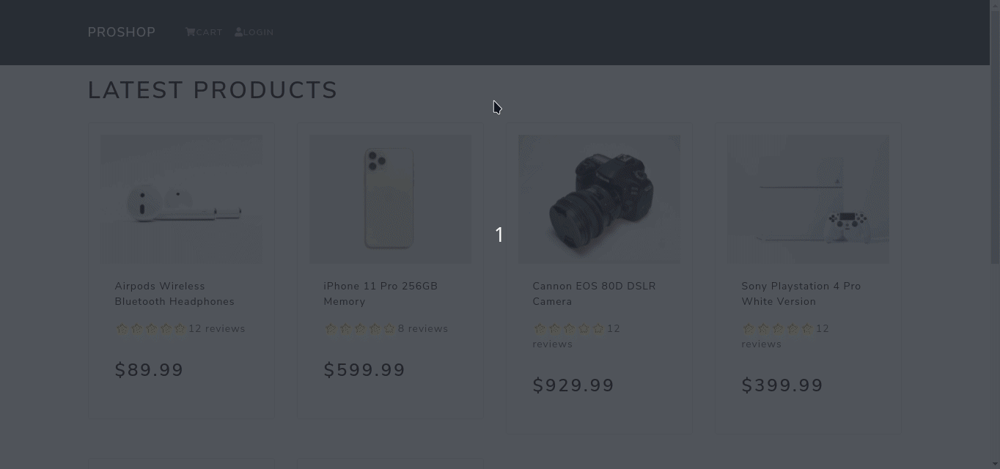
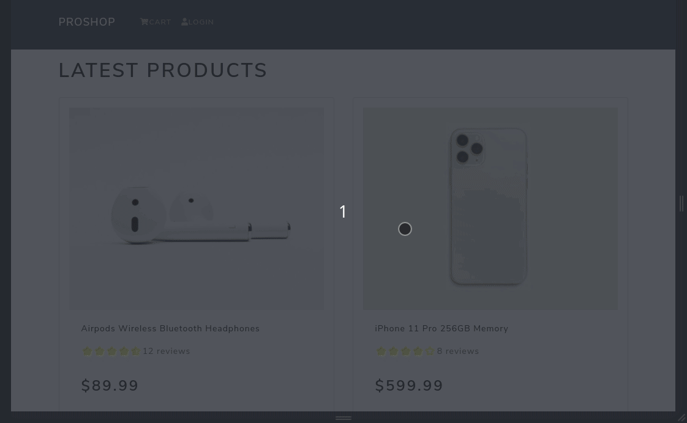

<div>
<h1 align='center'> :bulb:Introduction</h1>
<p>This is a project of an ecommerce build following the <a href='https://www.udemy.com/course/django-with-react-an-ecommerce-website/'>Django with React - An Ecommerce Website</a> course</p>
<br>
</div>

<div>
<h2 align='center'> :computer: Techs (in the frontend)</h2>
<p>In the course it's used React and React-Router, but I replaced it with NextJs</p>

| Name            | Link                               |
| --------------- | ---------------------------------- |
| NextJS          | https://nextjs.org/                |
| React-Bootstrap | https://react-bootstrap.github.io/ |

</div>

<br>

<div align='center'>
  <h2>How does it look like?</h2>
  <h3>Please keep in mind that this is just the beginning of the project, and there is still a long way to go</h3>
  <br>
  <h4>Desktop</h4>
  
  <br>
  <h4>Mobile</h4>
  
</div>
<br>

<h2 align='center'> :pencil2: Todo's</h2>

- [x] Start the frontend
- [x] Start the backend
- [x] Connect backend to frontend
- [x] Create a real DB
- [ ] Login Auth
- [ ] Admin Screen
- [ ] Product Reviews
- [ ] Search
- [ ] Pagination
- [ ] Deploy

<br>
<h2> :sunny: Usage</h2>
Clone this repository, then go to the frontend folder and run:

```bash
yarn
```

Then run the development server:

```bash
npm run dev
# or
yarn dev
```

Open [http://localhost:3000](http://localhost:3000) with your browser to see the result.
